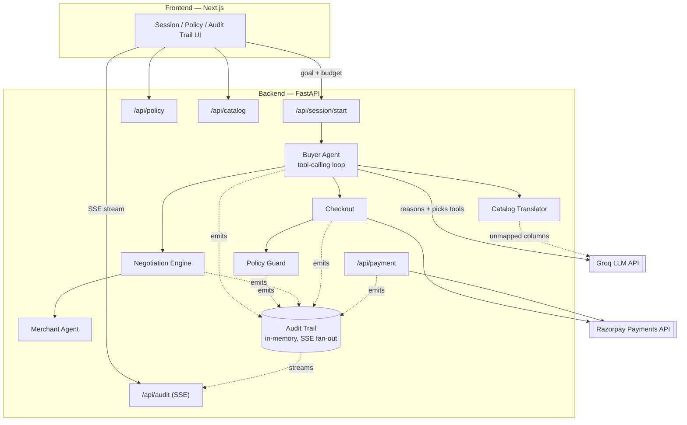

# Architecture

Agent Commerce Adapter is a demo of an AI buyer agent shopping a merchant's
catalog, negotiating price, and completing a real (test-mode) payment —
with every decision, guardrail check, and negotiation turn streamed live to
an audit trail.

## System diagram

## Request flow (a single buyer-agent session)

1. **Catalog** — `POST /api/session/start` loads and normalizes a merchant
   catalog file (`core/catalog_translator.py`) into the standard `Product`
   schema, using a known-alias table with an LLM fallback for unrecognized
   column names.
2. **Reasoning** — the Buyer Agent (`agents/buyer_agent.py`) runs a
   tool-calling loop against Groq: `search_catalog`, `get_product_details`,
   `negotiate_with_merchant`, `checkout`.
3. **Negotiation** — `core/negotiation.py` runs a bounded back-and-forth
   between the buyer's opening offer and the Merchant Agent's deterministic
   pricing floor (`core/merchant_agent.py`).
4. **Policy** — every checkout attempt is checked against `core/policy_guard.py`
   (spend caps, category rules, stock, per-session order limits) before a
   real payment is attempted.
5. **Payment** — `core/checkout.py` creates a real Razorpay test-mode Order;
   completing payment requires a human in a browser
   (`routes/payment.py:/pay/{order_id}`). The client's reported outcome is
   never trusted directly — `core/payments.py` always re-fetches the real
   status from Razorpay's Payments API.
6. **Audit trail** — every step above emits an `AuditEvent`
   (`core/audit_trail.py`), fanned out live over SSE to any number of
   subscribers (`routes/audit.py:/stream`) and rendered in the frontend's
   live feed.

## Current state boundary

Everything above is in-memory and single-process (the audit trail, session
history, and failure-injector state). This is deliberate for a demo — see
the Phase 2 roadmap for moving this to Postgres + Redis so it survives
restarts and works across multiple backend instances.
